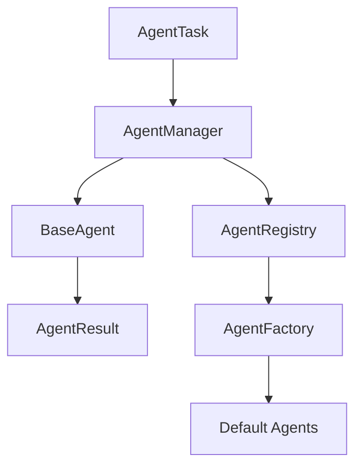

# Agent System

## Architecture

The Agent System is a provider-independent execution framework. It is designed to be used by future AI providers, but it does not contain AI logic itself. Agents describe capabilities, receive tasks, and produce structured results while delegating execution to the Runtime layer.

## Lifecycle

1. Initialize the agent.
2. Start the agent.
3. Receive a task.
4. Execute through the agent implementation.
5. Return a structured AgentResult.
6. Stop or pause as required.

## Task Flow

User request -> Brain goal -> Orchestrator -> AgentManager -> Agent -> Runtime worker

## Capability System

Capabilities are modeled as dataclasses and matched against task requirements. This makes it straightforward to add new agent types without central switch logic.

## Class Diagram

